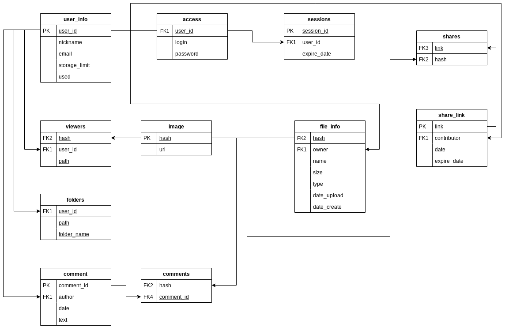

# Instatrash

Simple multi user a file storage application suggest LAMP server side and responsive web design single page application on client side. Website published [here](https://instatrash.000webhostapp.com/). The "test" is login there isn't password required.

Implemented functional :

- Multi file upload/download
- Arranging files in user defined directory
- Unsophisticated image viewer 
- A notes at file

Not implemented yet but intend:
- Share 
- Commenting
- Storage quota
 
Database schema:



## Getting Started
Contents this repository expected be place in web server as is. See deployment for notes on how to deploy the project.

### Prerequisites
A case using own web server (e.g. Apache2) with the php modules installed:

used PHP 7 (libapache2-mod, gd, mysql, zip)

```bash
sudo apt-get install php7.0 libapache2-mod-php7.0 php7.0-gd php7.0-mysql php7.0-zip -y
```
 
MySQL server available support **InnoDB** engine (otherwise cascade deleting will failure)


## Usage

Any modern web browser.

## Deployment

1) Comment out global resource path variables in [misc.php](src/misc.php).
```php
<?php
/*
include '../config/db.php';
ORIGINAL_PATH = "../resources/data";
$THUMB_PATH = "../public_html/thumbnails";
*/

//	Change paths on deployment

include '../../config/db.php';
$ORIGINAL_PATH = "../../resources/data";
$THUMB_PATH = "../thumbnails";

$log_file = "../errors.log"; 
```
2) Configure [db.php](config/db.php) appropriate MySQL a server driver invocation data.
```php
<?php
$db_config = array(
	'DB_HOST' => 'localhost',
	'DB_USERNAME' => '',
	'DB_PASSWORD' => '',
	'DB_DATABASE' => 'FileStore_app',
	'DB_TYPE' => 'mysql' 
	);
?>
```

3) Initiate FileStore_app database. Schema is defined in [SQL](docs/FileStore_db.sql) and [graphical depiction](docs/FileStore_db_schema.png) of the database structure.
```bash
php bin/initDB.php
```
4) Move the [src](src) folder to [public_html](public_html) (Apache's root directory)
```bash
mv src public_html
```
5) Copy public_html, config, resources folders to a server root directory (e.g. /var/www/ )
```bash
cp -R public_html /var/www && cp -R config /var/www && cp -R resources /var/www 
```


6) Create a user have to execute addUser.php or manually (e.g. phpMyAdmin )
```bash
php addUser.php login password
```


## Contributing
Pull requests are welcome. 

## Authors

* **Denis Vasilenko** - *Initial work* - [tuxtender](https://github.com/tuxtender)


## License
[MIT](LICENSE.md)

## Acknowledgments

* First experience a server-side scripting and web design
* Inspirited by Google Drive 
